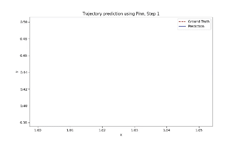
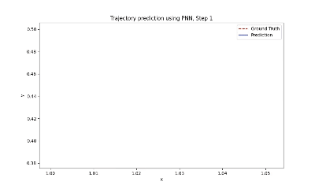

# Charged Particle Simulation with PINN, PNN and SympNet

## Project Overview

The goal of this project is to model the trajectory of a charged particle based on the physical laws governing its motion, then simulate and visualize this trajectory.
This project involves predicting the future states of a charged particle in an electromagnetic field using various neural network models, namely SympNets, PNNs (Poisson Neural Networks), and PINNs (Physics-Informed Neural Networks). Below is a summary of the tasks outlined:

- **Objective:** Predict the future states of a charged particle given its trajectory data using different neural networks.
- **Governing Equations:** The motion of the particle is governed by the Lorentz force and can be described by the equation:
### Governing Equation

The motion of a charged particle in an electromagnetic field is governed by the equation:

\[ m \ddot{x} = q \left( E + \dot{x} \times B \right) \]

where:
- \( m \) is the mass,
- \( q \) is the electric charge,
- \( x \) is the particle's position,
- \( E \) is the electric field,
- \( B \) is the magnetic field.

### Dataset

- The dataset includes velocity \( v \) and position \( x \) data for 1500 time points, generated by a Stormer–Verlet integrator.
- The data is provided in `train.txt` and `test.txt` files.
- **Initial State:** \( v_0 = (1, 0.5, 0) \) and \( x_0 = (0.5, 1, 0) \).
- The system reduces to a 2D dynamics problem, focusing on the first two dimensions.


> ### Here is the results of simulated trajectory
> ##### Using PINN


> ##### Using PNN



> ##### Using Sympnet


### Key Features:
- **Symplectic Neural Network (SympNet)** for learning dynamics.
- Simulation of charged particle trajectories.
- Visualization of particle motion over time.
- Video generation of the simulation.

## Dependencies

To run this project, you'll need the following libraries and tools installed:

- Python 3.7+
- PyTorch
- Numpy
- Matplotlib
- Imageio
- Pillow

Install the required packages via pip:

```bash
pip install -r requirements.txt
````


## Project Structure

```plaintext
├── data/                        # Dataset (training validation, testing data)
├── models/                      # Model architecture and training scripts
├── outputs/                     # Outputs including generated images and videos
├── notebooks/                   # Jupyter notebooks for experimentation and training
├── README.md                    # Project documentation
└── requirements.txt             # Python dependencies
```

## How to Run the Project

### 1. Data Preparation
Before training, ensure you have the necessary data in the `data/` directory. If needed, you can modify the data preprocessing steps in the code.

### 2. Train the Model
To train the SympNet model on the charged particle dataset:
run the jupyter Notebook 

The model will be saved in the `models/` directory after training.

### 3. Simulate Particle Trajectory
To simulate the trajectory of a charged particle using the trained model:


This will generate a series of images representing the particle's motion over time, saved in the `simulation_video/` directory.

### 4. Create a Video
Once the simulation is complete, you can create a video from the generated frames using the notebook

This will save the video in the `outputs/` directory as `particle_trajectory.mp4`.


## Visualization

During the simulation, the particle's trajectory is visualized as it moves through the magnetic field. After running the simulation, you can check the `outputs/` directory for both the images and the final video showcasing the particle's motion.

## Results

After training, the SympNet model achieves a low Mean Squared Error (MSE) on the test data, indicating accurate prediction of the particle's trajectory. The final video visualizes the predicted trajectory based on this learned model.

## Contributing

We welcome contributions to improve this project. If you find a bug or have a feature request, please open an issue. For code contributions, follow these steps:

1. Fork the repository.
2. Create a new branch (`git checkout -b feature-branch`).
3. Commit your changes (`git commit -m 'Add some feature'`).
4. Push to the branch (`git push origin feature-branch`).
5. Open a pull request.

## License

This project is licensed under the MIT License. See the `LICENSE` file for details.

## Acknowledgements

Special thanks to the developers of PyTorch and the SympNet framework, whose tools and libraries made this project possible.

## Contact

If you have any questions or suggestions, feel free to contact me at [Mail](mailto:puspakmeher3@gmail.com) and [LinkedIn](https://www.linkedin.com/in/puspakmeher3/?_l=en_US)

### References
1. Jin et al. (2020). "Learning Poisson systems and trajectories of autonomous systems via Poisson neural networks."
2. Jin et al. (2020). "Sympnets: Intrinsic structure-preserving symplectic networks for identifying Hamiltonian systems."
3. Raissi et al. (2019). "Physics-informed neural networks: A deep learning framework for solving forward and inverse problems involving nonlinear partial differential equations."
